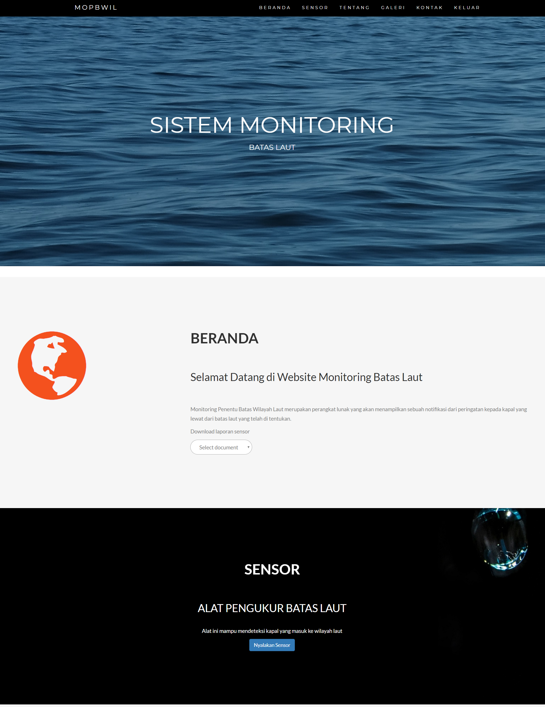
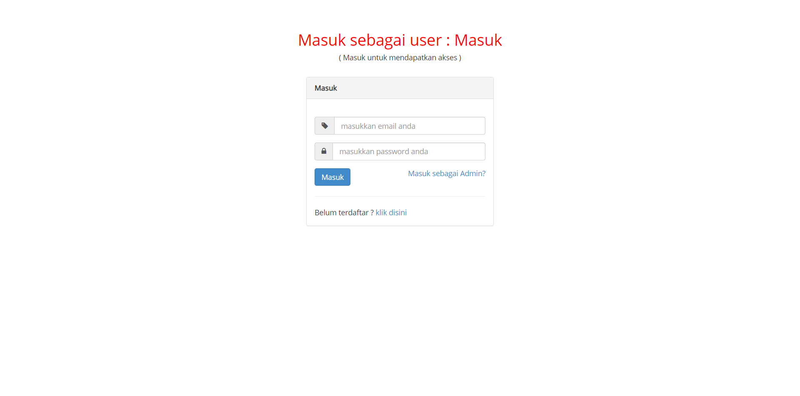
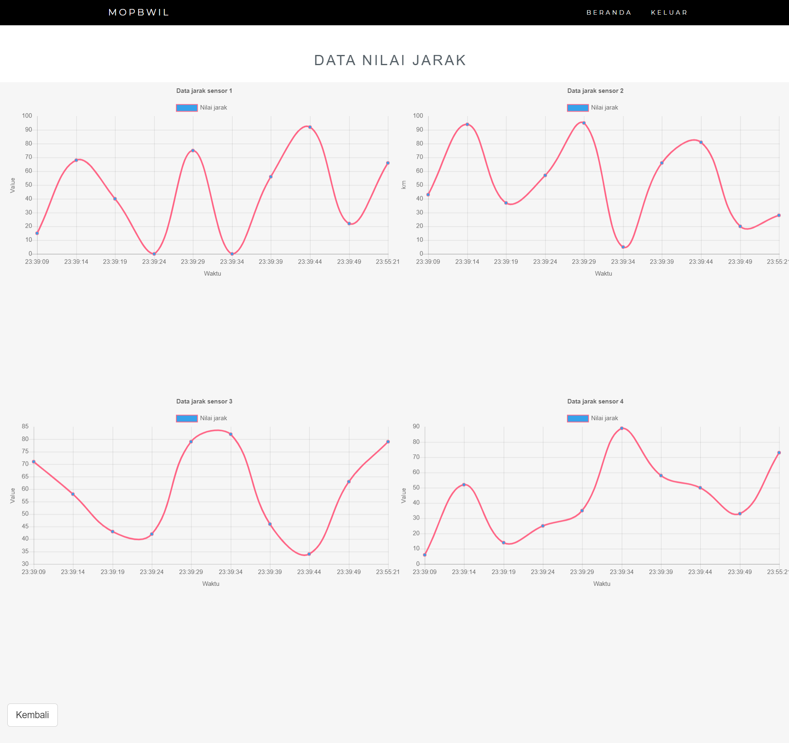
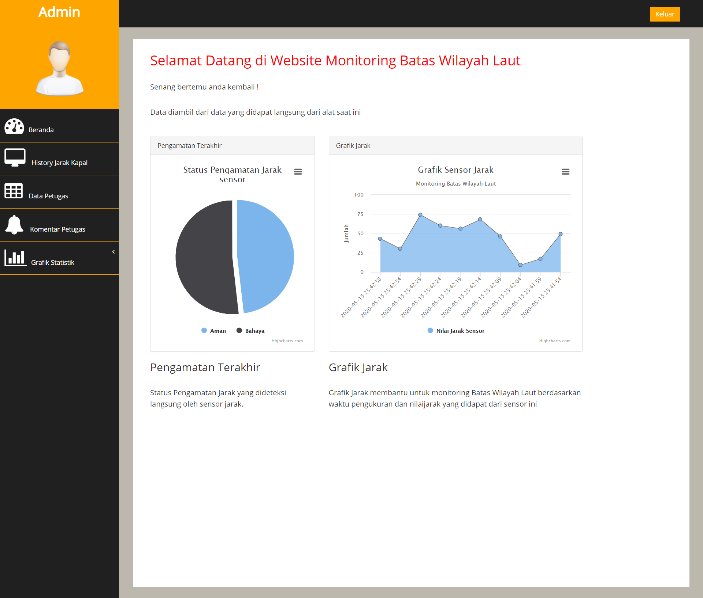

# MOPBWIL Project (Monitoring Batas Wilayah Laut)
Project ini merupakan simulasi website yang terhubung dengan sensor yang berada di perbatasan laut yang nilainya dapat dilihat pada tampilan website, terdiri dari User yang berperan sebagai petugas untuk melihat nilai sensor, unggah data sensor, dan memberikan komentar, dan Admin yang berperan untuk memantau data nilai sensor dalam bentuk grafik, data User, dan status bahaya pada sensor

homepage preview

Login Page Preview

Sensor Page Preview

Admin Page Preview

